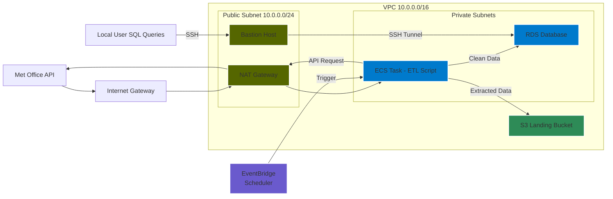

# Met Office ETL Infrastructure

---

**Legend:**
- **S3Bucket**: S3 landing bucket for extracted data (green)
- **PublicSubnet**: Contains NAT Gateway and Bastion Host (orange)
- **PrivateA/PrivateB**: ECS tasks and RDS MySQL instance (blue)
- **Security Groups**: ECS, Bastion, and RDS (pink)
- **Bastion Host**: Used for secure SSH tunneling from your local machine to RDS
- **ECS Outbound API**: ECS tasks send API requests to the internet via NAT Gateway

---

## Infrastructure Components

### Networking
- **VPC**: `10.0.0.0/16`
  - DNS hostnames: enabled
  - DNS support: enabled

### Subnets
- **Public**: `10.0.0.0/24` (eu-west-2a)
- **Private A**: `10.0.1.0/24` (eu-west-2a)
- **Private B**: `10.0.2.0/24` (eu-west-2b)

### Security Groups
- **RDS Security Group**
  - Inbound: Port 3306 (MySQL)
  - Source: ECS Security Group, Bastion SG
- **ECS Security Group**
  - Outbound: 443 (HTTPS), 3306 (MySQL)
- **Bastion Security Group**
  - Inbound: Port 22 (SSH)
  - Source: Your IP
  - Outbound: All traffic

### Database
- **Engine**: MySQL 8.0
- **Name**: metofficecleandb
- **Deployment**: Multi-AZ
- **Network**: Private subnets

### S3
- **Landing Bucket**: Stores extracted weather data from Met Office API
- **Access**: Via S3 Gateway Endpoint from private subnets

### VPC Endpoints
- **S3**: Gateway endpoint
- **RDS**: Interface endpoint